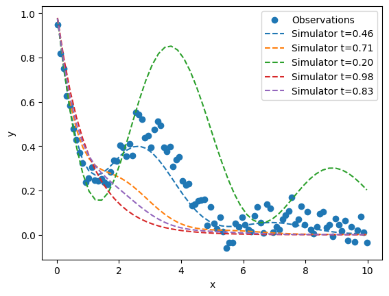

# Basics

In this notebook we demonstrate building a simple Kennedy & O'Hagan model.

The user is required to provide two structures:

1. A class which inherits from `KOHModel` and defines the GP kernel structures,
2. A dictionary of prior definitions for each model parameter.

We also run through an example by loading a dataset and calculating the negative log posterior density (NLPD) using the parameter prior means.


```python
import gpjax as gpx
import jax.numpy as jnp
import numpy as np
from jax import config

config.update("jax_enable_x64", True)
```


```python
#
# ## Step 1: Define the model
#
# Defining both `k_eta` and `k_delta` is required.
# Defining `k_epsilon_eta` is completely optional - default behaviour sets variance to 0 effectively turning off this kernel.
# Defining `k_epsilon` here is also optional. A white noise kernel is used by default but a prior definition must always be provided by the user. The kernel will search for the variance parameter prior under ['epsilon', 'variances', 'variance'] of the prior dictionary by default.
#
# In this example variances are defined as the inverse of a precision parameter.
# This is inkeeping with Higdon et al. (2004).
```


```python
from kohgpjax.kohmodel import KOHModel


class OurModel(KOHModel):
    def k_eta(self, params_constrained) -> gpx.kernels.AbstractKernel:
        params = params_constrained["eta"]
        return gpx.kernels.ProductKernel(
            kernels=[
                gpx.kernels.RBF(
                    active_dims=[0],
                    lengthscale=jnp.array(params["lengthscales"]["x_0"]),
                    variance=jnp.array(1 / params["variances"]["precision"]),
                ),
                gpx.kernels.RBF(
                    active_dims=[1],
                    lengthscale=jnp.array(params["lengthscales"]["theta_0"]),
                    # variance=1.0, # This is not required as the variance is set to 1 by default
                ),
            ]
        )

    def k_delta(self, params_constrained) -> gpx.kernels.AbstractKernel:
        params = params_constrained["delta"]
        return gpx.kernels.RBF(
            active_dims=[0],
            lengthscale=jnp.array(params["lengthscales"]["x_0"]),
            variance=jnp.array(1 / params["variances"]["precision"]),
        )

    def k_epsilon(self, params_constrained) -> gpx.kernels.AbstractKernel:
        params = params_constrained["epsilon"]
        return gpx.kernels.White(
            active_dims=[0],
            variance=jnp.array(1 / params["variances"]["precision"]),
        )
    
    # def k_epsilon_eta(self, params_constrained) -> gpx.kernels.AbstractKernel:
    #     params = params_constrained["epsilon_eta"]
    #     return gpx.kernels.White(
    #         active_dims=[1],
    #         variance=jnp.array(1 / params["variances"]["precision"]),
    #     )
```

## Step 2: Define the priors


```python
import numpyro.distributions as dist

from kohgpjax.parameters import ModelParameterPriorDict, ParameterPrior

prior_dict: ModelParameterPriorDict = {
    "thetas": {
        "theta_0": ParameterPrior(
            dist.Uniform(low=0.3, high=0.5),
            name="theta_0",
        ),
    },
    "eta": {
        "variances": {
            "precision": ParameterPrior(
                dist.Gamma(concentration=2.0, rate=4.0),
                name="eta_precision",
            ),
        },
        "lengthscales": {
            "x_0": ParameterPrior(
                dist.Gamma(concentration=4.0, rate=1.4),
                name="eta_lengthscale_x_0",
            ),
            "theta_0": ParameterPrior(
                dist.Gamma(concentration=2.0, rate=3.5),
                name="eta_lengthscale_theta_0",
            ),
        },
    },
    "delta": {
        "variances": {
            "precision": ParameterPrior(
                dist.Gamma(concentration=2.0, rate=0.1),
                name="delta_precision",
            ),
        },
        "lengthscales": {
            "x_0": ParameterPrior(
                dist.Gamma(concentration=4.0, rate=2.0),
                name="delta_lengthscale_x_0",
            )
        },
    },
    "epsilon": {
        "variances": {
            "precision": ParameterPrior(
                dist.Gamma(concentration=12.0, rate=0.025),
                name="epsilon_precision",
            ),
        },
    },
    # 'epsilon_eta': {
    #     'variances': {
    #         'precision': ParameterPrior(
    #             dist.Gamma(concentration=10.0, rate=0.001),
    #             name='epsilon_eta_precision',
    #         ),
    #     },
    # },
}
```

## Step 3: Load the example dataset


```python
from kohgpjax.dataset import KOHDataset

DATAFIELD = np.loadtxt('data/field.csv', delimiter=',', dtype=np.float32)
DATASIM = np.loadtxt('data/sim.csv', delimiter=',', dtype=np.float32)

xf = jnp.reshape(DATAFIELD[:, 0], (-1, 1)).astype(jnp.float64)
xc = jnp.reshape(DATASIM[:, 0], (-1, 1)).astype(jnp.float64)
tc = jnp.reshape(DATASIM[:, 1], (-1, 1)).astype(jnp.float64)
yf = jnp.reshape(DATAFIELD[:, 1], (-1, 1)).astype(jnp.float64)
yc = jnp.reshape(DATASIM[:, 2], (-1, 1)).astype(jnp.float64)

field_dataset = gpx.Dataset(xf, yf)
sim_dataset = gpx.Dataset(jnp.hstack((xc, tc)), yc)

kohdataset = KOHDataset(field_dataset, sim_dataset)
print(kohdataset)
```

    KOHDataset(
      Datasets:
        Field data = Dataset(Number of observations: 100 - Input dimension: 1),
        Simulation data = Dataset(Number of observations: 500 - Input dimension: 2)
      Attributes:
        No. field observations = 100,
        No. simulation outputs = 500,
        No. variable params = 1,
        No. calibration params = 1,
    )


```python
import matplotlib.pyplot as plt

fig, ax = plt.subplots(1, 1)
ax.scatter(xf, yf, label='Observations')
rng = np.random.default_rng()
ts = rng.permutation(np.unique(tc))[:5]
for t in ts:
    rows = tc==t
    ax.plot(xc[rows], yc[rows], '--', label=f'Simulator t={t:.2f}')
ax.set_xlabel('x')
ax.set_ylabel('y')
ax.legend()
plt.show()
```


    

    


## Step 4: Calculate the NLPD

We now build a `ModelParameters` object using the prior dictionary defined above and pass it to the `OurModel` class along with the `KOHDataset` object.


```python
from jax import grad, jit

from kohgpjax.parameters import ModelParameters

model_parameters = ModelParameters(prior_dict=prior_dict)
our_model = OurModel(
    kohdataset=kohdataset,
    model_parameters=model_parameters,
)
nlpd_func = our_model.get_KOH_neg_log_pos_dens_func()

# JIT-compile the NLPD function
nlpd_jitted = jit(nlpd_func)

# Compute the gradient of the NLPD
grad_nlpd_jitted = jit(grad(nlpd_func))
```


```python
# Calculate the negative log posterior density using the prior means
from jax import tree as jax_tree

prior_leaves, prior_tree = jax_tree.flatten(prior_dict)
prior_means = jax_tree.map(
    lambda x: x.inverse(x.distribution.mean), prior_leaves
)

init_states = np.array(prior_means) # NOT jnp.array

print("Initial states:", init_states)
nlpd_value = nlpd_jitted(init_states)
print("Negative log posterior density:", nlpd_value)
grad_nlpd_value = grad_nlpd_jitted(init_states)
print("Gradient of NLPD:", grad_nlpd_value)
```

    Initial states: [ 6.93147181e-01  2.99573227e+00  6.17378610e+00 -5.59615788e-01
      1.04982212e+00 -6.93147181e-01  4.44089210e-16]
    Negative log posterior density: 18302.367816505932


    Gradient of NLPD: [-7.15381155e+00 -3.35597841e+00 -5.39850702e+00  8.74188396e+04
      1.09173526e+05  1.12665347e+04  6.12961026e-01]


## Step 5: Implement an MCMC sampler

We can now implement an MCMC algorithm to sample from the posterior distribution. I recommend Mici for python-based MCMC sampling or BlackJAX for JAX-based MCMC sampling.
Also see STAN and PyMC for other options.
